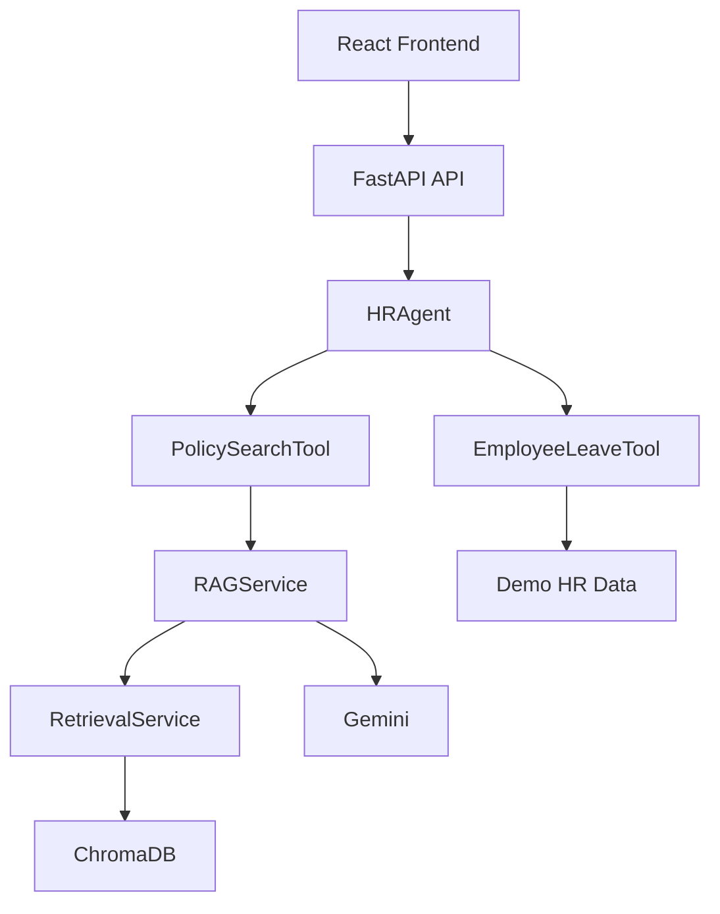
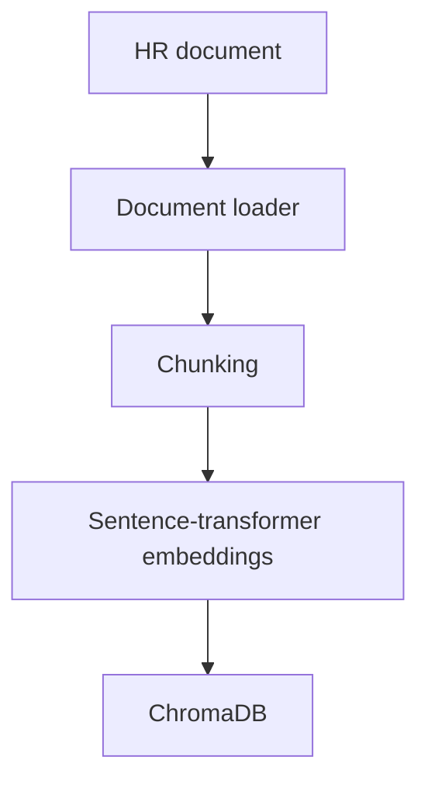

# HRMS-AI

An AI-powered HR assistant demonstrating Retrieval-Augmented Generation
(RAG), semantic document retrieval, Gemini-based answer generation, and
deterministic tool-based agent orchestration. The project separates policy
question answering from employee-specific leave lookups so each path is
simple to inspect and explain.

## Project Overview

HR policy information is often stored in documents, while employee-specific
information is better represented as structured records. HRMS-AI demonstrates
both approaches behind a single assistant:

- HR policy questions are answered through document retrieval and grounded
  Gemini generation.
- Questions containing a specific employee ID are answered by a structured
  employee leave tool using fictional demo data.

The primary demonstration endpoint is `POST /api/agent/ask`, also available
through the React frontend.

## Key Features

- RAG-based HR policy question answering
- Document loading, text chunking, and ingestion
- Sentence-transformer embeddings
- Local ChromaDB vector search
- Google Gemini LLM integration
- Deterministic HR agent
- Tool-based question routing
- FastAPI REST API
- React, TypeScript, and Vite frontend
- Automated pytest coverage
- Source-aware retrieval with document and chunk metadata
- CORS configuration for local frontend/backend development

## Architecture

### Request and tool orchestration



### Document ingestion



The agentic layer is an orchestration layer above the RAG pipeline. It does
not replace document retrieval, embeddings, ChromaDB, or Gemini generation.

## RAG Pipeline

The policy-search path works as follows:

1. `IngestionService` loads an HR document.
2. The document is split into overlapping text chunks.
3. `EmbeddingService` creates an embedding for each chunk.
4. `VectorStoreService` stores chunks, embeddings, and source metadata in
   local ChromaDB.
5. A user question is converted into a query embedding.
6. `RetrievalService` performs semantic similarity search.
7. `RAGService` passes the retrieved chunks to `LLMService`.
8. `LLMService` sends a grounded prompt to Gemini.
9. The answer is returned with the retrieved source document and chunk index
   where the API response supports source metadata.

The Gemini prompt instructs the model to use only the supplied HR document
context, avoid inventing policies or facts, and explain when the answer is not
available in the retrieved documents.

## Agentic HR Assistant

`HRAgent` receives the user question and selects one of two tools:

- If an employee ID such as `E001` is present, it routes to
  `EmployeeLeaveTool`.
- Otherwise, it routes to `PolicySearchTool`.

`PolicySearchTool` delegates to the existing `RAGService`, which performs
retrieval and Gemini generation. `EmployeeLeaveTool` accesses fictional,
structured demo HR data containing sample employee leave records.

The current router is deterministic rather than LLM-driven. This was
intentionally implemented as a transparent first-stage agentic architecture,
not as a multi-agent system. An LLM-based tool-calling router could later
replace the deterministic router while preserving the tool interfaces.

## Example Questions

### HR policy question

```text
How many annual leave days are employees entitled to?
```

Routing path:

```text
HRAgent → PolicySearchTool → RAG → Gemini
```

### Employee leave question

```text
How much leave does E001 have?
```

Routing path:

```text
HRAgent → EmployeeLeaveTool → Demo employee data
```

The employee tool uses fictional demo records such as `E001`; these records
are not production employee data.

## Tech Stack

- Python
- FastAPI
- React
- TypeScript
- Vite
- Sentence Transformers
- ChromaDB
- Google Gemini
- Pytest
- Git

## Project Structure

```text
HRMS-AI/
├── backend/
│   ├── app/
│   │   ├── agents/
│   │   │   ├── hr_agent.py
│   │   │   └── tools/
│   │   ├── services/
│   │   └── main.py
│   ├── tests/
│   │   └── agents/
│   ├── .env.example
│   └── requirements.txt
├── documents/
├── frontend/
│   ├── src/
│   │   ├── components/
│   │   └── services/
│   ├── .env.example
│   └── package.json
├── .gitignore
└── README.md
```

Runtime directories such as `.venv`, `__pycache__`, `node_modules`, build
output, and local ChromaDB files are intentionally omitted.

## Running Locally

### Backend

From the project root, create and activate a virtual environment:

```powershell
python -m venv .venv
.\.venv\Scripts\Activate.ps1
```

Install backend dependencies:

```powershell
pip install -r backend/requirements.txt
```

Copy `backend/.env.example` to `backend/.env` and configure the local
backend settings. Start FastAPI from the project root:

```powershell
python -m uvicorn backend.app.main:app --reload
```

The API is available at `http://127.0.0.1:8000`. Swagger documentation is
available at `http://127.0.0.1:8000/docs`.

### Frontend

Copy `frontend/.env.example` to `frontend/.env` if the default backend URL
needs to be changed. The frontend reads `VITE_API_BASE_URL` when calling the
FastAPI backend.

```powershell
cd frontend
npm install
npm run dev
```

Open the Vite URL shown in the terminal. The local FastAPI configuration
allows the Vite development origins `localhost:5173` and `127.0.0.1:5173`.

## API Examples

### `POST /api/rag/ingest`

Request:

```json
{
  "filename": "leave_policy.txt"
}
```

Response shape:

```json
{
  "filename": "leave_policy.txt",
  "chunk_count": 1
}
```

### `POST /api/rag/ask`

Request:

```json
{
  "question": "How many annual leave days are employees entitled to?"
}
```

Response shape:

```json
{
  "question": "How many annual leave days are employees entitled to?",
  "answer": "...",
  "sources": [
    {
      "source_document": "leave_policy.txt",
      "chunk_index": 0
    }
  ]
}
```

### `POST /api/agent/ask`

Request:

```json
{
  "question": "How much leave does E001 have?"
}
```

Response shape:

```json
{
  "question": "How much leave does E001 have?",
  "answer": "Aisha Khan (E001) has 21 annual leave days and 5 emergency leave days."
}
```

The agent endpoint is the primary frontend demonstration endpoint.

## Testing

Run the complete backend test suite from the project root:

```powershell
python -m pytest backend/tests -v
```

The suite covers document processing, embeddings, ingestion, retrieval, RAG
orchestration, API behavior, and agent routing. Tests use fake services where
appropriate, so automated tests do not require real Gemini API calls.

## Security / Secrets

- The Gemini API key belongs in the backend's local `.env` file.
- `.env` files are ignored by Git.
- `backend/.env.example` contains configuration placeholders only.
- The frontend does not receive or contain the Gemini API key.
- API keys and other secrets must never be committed.

## Limitations

- Routing is deterministic rather than LLM-based tool calling.
- Employee leave records are fictional demo data.
- ChromaDB runs as a local vector store.
- Configuration is intended for local development.
- Authentication and authorization are not implemented yet.
- The application is a portfolio/demo implementation, not a production HRMS.

## Future Improvements

- Replace deterministic routing with LLM-based tool calling.
- Add additional HR tools and policy domains.
- Connect employee tools to a real HRMS database.
- Add authentication and authorization.
- Provide richer source citations and relevance details.
- Use a production vector database.
- Add an evaluation dataset for RAG quality.
- Deploy the application to the cloud.

## Author / Contribution

Designed and implemented the RAG pipeline, document ingestion, embedding and
retrieval services, Gemini integration, deterministic agent/tool
orchestration, FastAPI APIs, automated tests, and React demonstration
interface.
